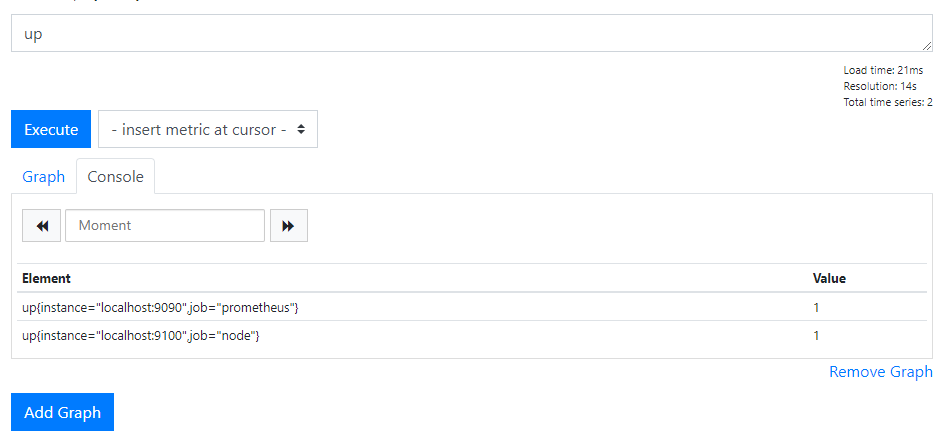

## 프로메테우스 실행

1. 다운로드, linux 버전
https://prometheus.io/download 

2. 압축 풀기, 폴더 들어가기
```
tar -xzf prometheus-*.linux-amd64.tar.gz
cd prometheus-*.linux-amd64/
```

3. 다음 내용 포함되도록 prometheus.yml 설정
```yml
global:
  scrape_interval: 10s
scrape_configs:
  - job_name: 'prometheus'
    static_configs:
    - targets: ['localhost:9090']
```
4. 실행
./prometheus 

5. 페이지
- 수행작업 파악: target - http://localhost:9090/targets
- 메트릭: metric - http://localhost:9090/metrics


## 수식 브라우저
1. 그래프 
- http://localhost:9090/graph

2. 표현식 
- up : 데이터 수집 성공 시 1
- process_resident_memory_bytes : 현재 메모리 사용량
- prometheus_tsdb_head_samples_appended_total : 프로메테우스가 모은 샘플 수

- 함수
    - rate : rate(prometheus_tsdb_head_samples_appended_total[1m]) 1분동안 몇개의 샘플저장 하는지 확인


## 노드 익스포터

1. 다운로드, linux 버전
- https://prometheus.io/download/

- 압축 풀기, 폴더 들어가기
```
tar -xzf node_exporter-*.linux-amd64.tar.gz
cd node_exporter-*.linux-amd64/
./node_exporter
```
- 윈도우버전(https://github.com/prometheus-community/windows_exporter/releases)

3. prometheus.yml 설정 - 해당 내용 추가
```yml
global:
  scrape_interval: 10s
scrape_configs:
  - job_name: 'prometheus'
    static_configs:
    - targets: ['localhost:9090']
  - job_name: 'node'
    static_configs:
    - targets: ['localhost:9100']  
```
4. 프로메테우스 재시작 
- ctrl+c(종료)
- ./prometheus

5. up 결과


6. 명령어
- label matcher
 process_resident_memory_bytes{job="node"}
- 네트워크 인터페이스에 수신된 데이터를 바이트 단위로 표시하는 카운터 값:
node_network_receive_bytes_total

## 알림
1. node exporter 중지

2. localhost:9090/targets
- node - DOWN

3. localhost:9090/graph 콘솔 up
- up{instance="localhost:9100",job="node"} = 0
- up == 0 : up이 0인 인스턴스만 반환

4. set prometheus.yml, rules.yml
- prometheus.yml
```yml
# my global config
global:
  scrape_interval:     10s 
  evaluation_interval: 10s 

# Alertmanager configuration
alertmanagers:
  - static_configs:
    - targets: ['localhost:9093']

rule_files:
  - "rules.yml"

# A scrape configuration containing exactly one endpoint to scrape:
scrape_configs:
  - job_name: 'prometheus'
    static_configs:
    - targets: ['localhost:9090']
  - job_name: 'node'
    static_configs:
    - targets: ['localhost:9100']
```

- rules.yml
```yml
groups:
    - name: example
      rules:
        - alert: InstanceDown
          expr: up == 0
          for: 1m
```

5. 재시작
6. 결과


7. 다운로드: alertmanager
- https://prometheus.io/download/

- 압축 풀기, 폴더 열기
```
tar -xzf alertmanager-*.linux-amd64.tar.gz
cd alertmanager-*.linux-amd64
```

8. alertmanager.yml 수정하기(https://prometheus.io/docs/alerting/latest/configuration/#email-receiver-)

- smtp 설정(windows)
```yml

global:
  smtp_smarthost: 'localhost:25'
  smtp_from: 'youraddress@example.com'

route:
  receiver: example-email

receivers:
  - name: example-email
    email_configs:
      - to: 'youraddress@example.com'
```

- OR : slack web hook 설정(https://grafana.com/blog/2020/02/25/step-by-step-guide-to-setting-up-prometheus-alertmanager-with-slack-pagerduty-and-gmail/)
9. 실행:
```
./alertmanager
```

# 메트릭 게시

## spring boot

https://jongmin92.github.io/2019/12/04/Spring/prometheus/

Spring Boot 2.0 이상부터는 애플리케이션의 metric 측정을 위해서 Micrometer를 제공한다. Micrometer는 Spring Boot 2의 Actuator에 포함되어 있기 때문에 spring-boot-starter-actuator를 dependency에 추가해주면 쉽게 사용할 수 있다.

추가적으로 micrometer-registry-prometheus dependency가 필요하다. 이 dependency는 Micrometer가 만들어내는 metric을 Prometheus 서버에서 사용할 수 있는 metric format으로 변경한다.

- build.gradle
```groovy
dependencies {
    implementation 'org.springframework.boot:spring-boot-starter-actuator'
    implementation 'io.micrometer:micrometer-registry-prometheus'
}
```

- prometheus.yml
```yml
global:
  scrape_interval: 10s # 10초 마다 Metric을 Pulling
  evaluation_interval: 10s
scrape_configs:
  - job_name: 'spring-boot-app'
    metrics_path: '/actuator/prometheus' # Application prometheus endpoint
    static_configs:
      - targets: ['localhost:8080'] # Application host:port

```

- 사용할 label

1. http_server_requests_seconds : http 요청에 걸린 시간
2. system_cpu_usage : cpu 사용량
3. 